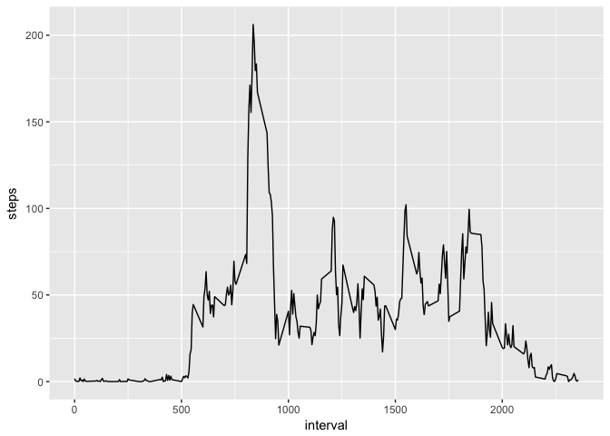
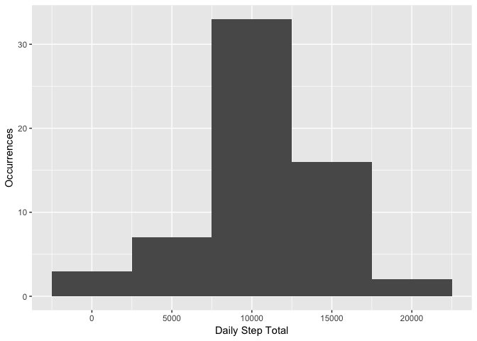

## Loading and preprocessing the data

The activity.zip file contains a CSV-formatted file which holds the data for this analysis. The shape of the data is a series of observations of three variables: number of steps, date of measurement, and the five-minute interval during which the measurement was made. 

Days where no measurement was made are represented with 'NA's


```r
unzip("activity.zip")
activityDF <- read.csv("activity.csv")

head(activityDF)
```

```
##   steps       date interval
## 1    NA 2012-10-01        0
## 2    NA 2012-10-01        5
## 3    NA 2012-10-01       10
## 4    NA 2012-10-01       15
## 5    NA 2012-10-01       20
## 6    NA 2012-10-01       25
```


## What is mean total number of steps taken per day?

Some days do not have step measurements, indicated by 'NA's in the data frame. This part of the analysis will ignore missing data.


```r
library(ggplot2)

daily_sum <- aggregate(activityDF$steps, 
                       list(Date=activityDF$date), 
                       FUN=sum, 
                       simplify=TRUE)

names(daily_sum) <- c("Date", "steps")

g <- ggplot(daily_sum, aes(steps)) + 
    geom_histogram(na.rm=TRUE, binwidth = 5000) +
    xlab("Daily Step Total") +
    ylab("Occurrences")

print(g)
```

<!-- -->

**The mean of daily steps is 10766.19.**

**The median of daily steps is 10765.**

## What is the average daily activity pattern?

Each daily five minute interval, from 0 to 2355, contains a measurement. The following graph presents the five-minute average across all days.


```r
library(ggplot2)

interval_mean <- aggregate(activityDF$steps,
                          list(interval=activityDF$interval),
                          FUN=mean, na.rm=T)

names(interval_mean) <- c("interval", "mean.steps")

g <- ggplot(interval_mean, aes(interval,mean.steps)) + geom_line() + ylab("steps")

print(g)
```

<!-- -->

**The five minute interval which averaged the most steps across all
days was 835**

## Imputing missing values

Missing data are encoded as ```NA```.  The number of missing step count values is 2304.

The following code will fill in missing values for each interval with a missinsg step value, using the 5-minute interval average across all measured days.


```r
library(dplyr)
```

```
## 
## Attaching package: 'dplyr'
```

```
## The following objects are masked from 'package:stats':
## 
##     filter, lag
```

```
## The following objects are masked from 'package:base':
## 
##     intersect, setdiff, setequal, union
```

```r
imputedDF <- activityDF

imputedDF <- inner_join(imputedDF, interval_mean, by = "interval")

imputedDF[is.na(imputedDF$steps),1] <- imputedDF[is.na(imputedDF$steps),4]

imputed_daily_sum <- aggregate(imputedDF$steps, 
                               list(Date=imputedDF$date), 
                               FUN=sum, 
                               simplify=TRUE)

names(imputed_daily_sum) <- c("Date", "steps")

g <- ggplot(imputed_daily_sum, aes(steps)) + 
    geom_histogram(na.rm=TRUE, binwidth = 5000) +
    xlab("Daily Step Total") +
    ylab("Occurrences")

print(g)
```

<!-- -->

**The mean of daily steps with imputed missing values is 10766.19**

**The median of daily steps with imputed missing vlaues is 10766.19**

The updated mean and median values are nearly the same as the computation made before which omitted `NA` values.

## Are there differences in activity patterns between weekdays and weekends?

The following analysis will include the imputed values for intervals where no data was collected. 

The panel plot below shows the average step totals over weekdays and weekends.  


```r
imputedDF$date <- as.Date(imputedDF$date)
imputedDF$dayOfWeek <- weekdays(imputedDF$date, c(TRUE))
imputedDF$isWeekend <- sapply(imputedDF$dayOfWeek, 
                              function(x) { 
                                  if(x == "Sat" | x == "Sun") 
                                  { 
                                    "Weekend" 
                                  } else { 
                                    "Weekday"
                                  }
                              },
                              simplify = TRUE
                          )


graph <- ggplot(imputedDF, aes(interval,steps)) + 
         geom_line() + 
         facet_grid(isWeekend ~ .)

print(graph)
```

<!-- -->

There are more steps on average weekdays between the hours of 6 and 10am than the same intervals on weekends.  There are also more steps on weekends after 8pm than during the corresponding weekday times.
